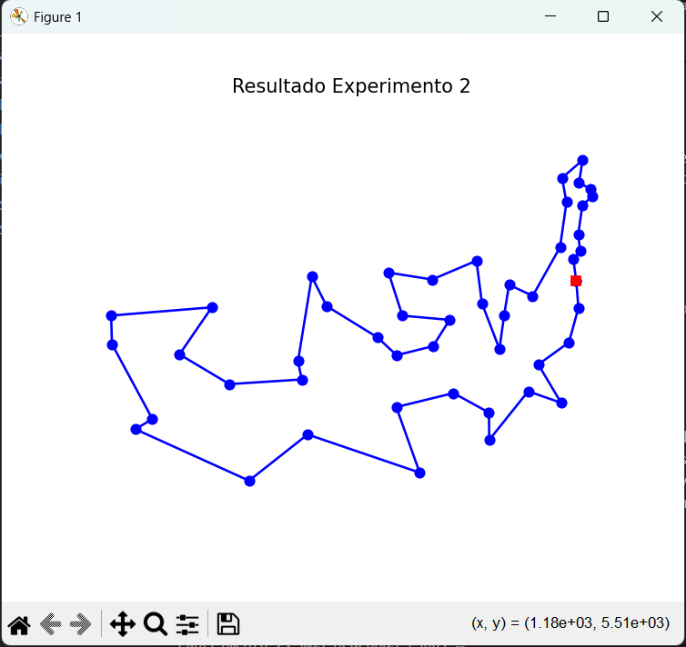
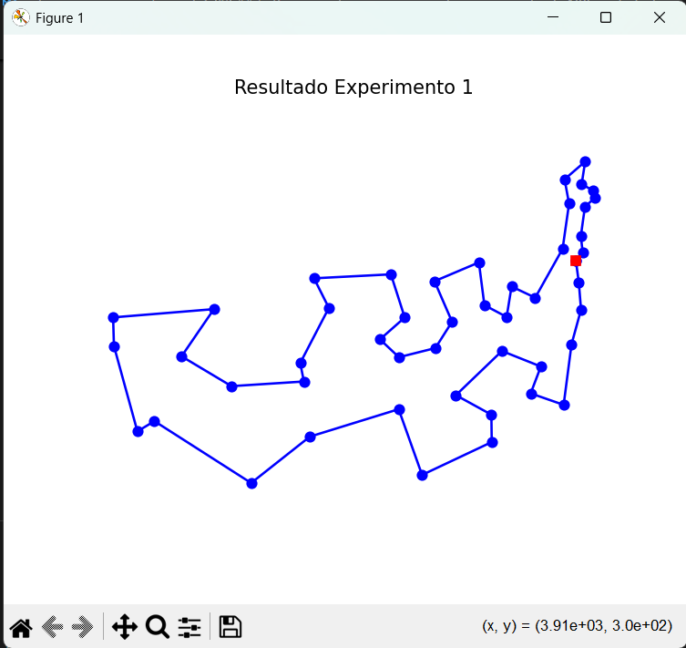
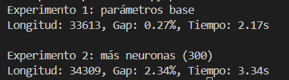
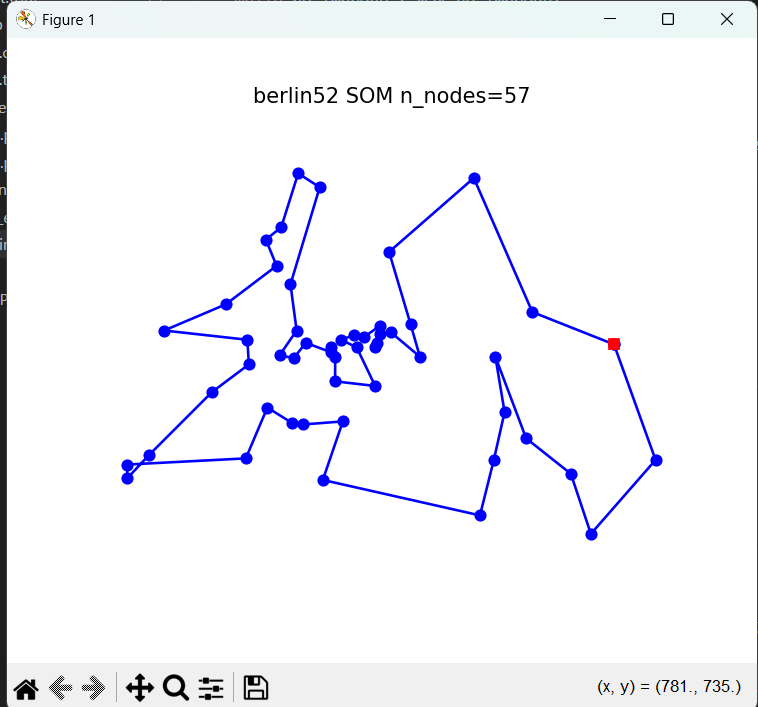
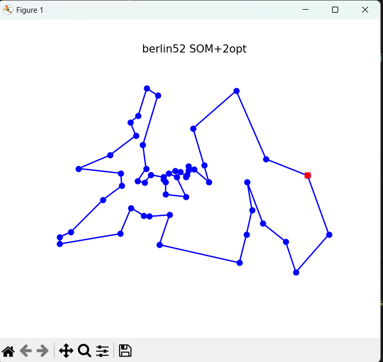
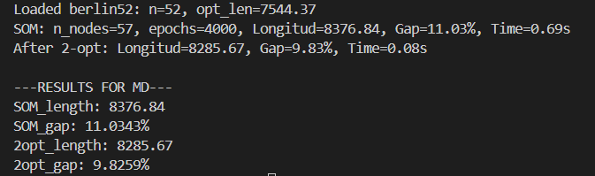
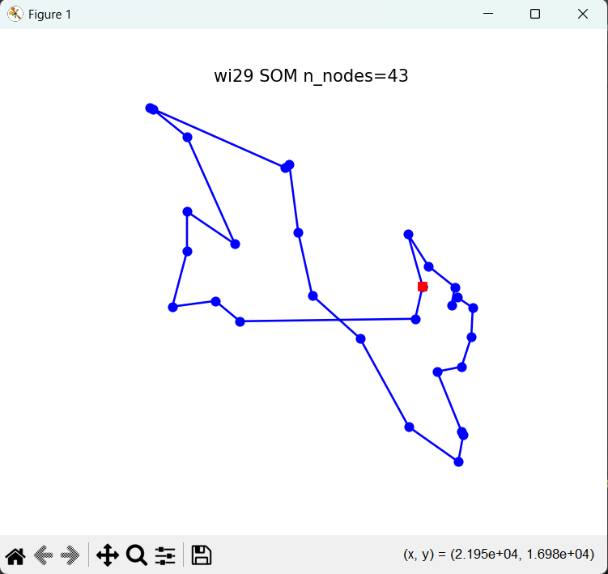
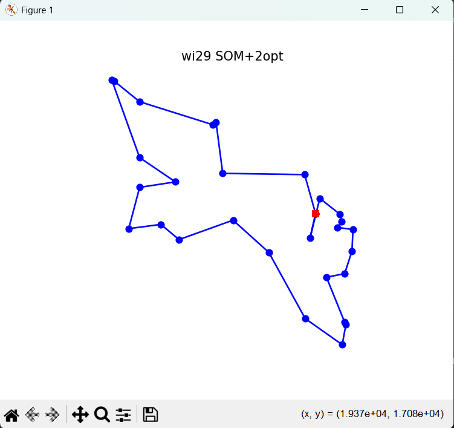
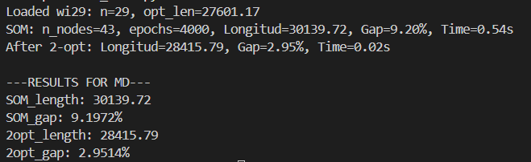

    # Informe de Experimentos - SOM para TSP

Este documento responde y documenta los experimentos solicitados sobre el uso de un Self-Organizing Map (SOM) para resolver instancias del Traveling Salesman Problem (TSP). Incluye metodología, código de ejemplo para ejecutar los experimentos en el repositorio, métricas, observaciones esperadas y recomendaciones.

## 1. Metodología común

- Dataset: `att48.tsp` (TSPLIB). En tu repositorio `SD.py` ya hay una función `load_problem(path)` que devuelve `cities` y `opt_tour`.
- Función SOM: `som_tsp(cities, n_nodes, epochs, learning_rate=..., radius_start=..., radius_end=...)` (archivo `SOM_TSP.py`).
- Métricas:
  - Longitud del tour: `tour_length(tour)` (función en `SD.py`).
  - Gap respecto al optimo: `gap(opt_length, length)` (ya definida).
- Visualización: `plot_tour(tour, title=...)` en `SD.py`. Para evitar que la ejecución se bloquee en `plt.show()`, puedes cambiar esa función para `plt.savefig(...)` si prefieres ejecuciones sin ventana.

## 2. Experimentos solicitados

Cada experimento retorna la(s) longitud(es) obtenida(s), el gap relativo, y guarda gráficos de ejemplo.

### Experimento 1: Número de neuronas

Instrucciones:
- n = número de ciudades (por ejemplo 48 para `att48`).
- Probar `n_nodes = 2*sqrt(n), 4*sqrt(n), 8*sqrt(n)`.

Código de ejemplo (añadir a `experimentos.py` o crear un script nuevo):

```python
from math import sqrt
from SD import load_problem, tour_length, gap, plot_tour
from SOM_TSP import som_tsp

cities, opt = load_problem('att48.tsp')
opt_len = 33524
n = len(cities)
for f in [2, 4, 8]:
    n_nodes = int(f * sqrt(n))
    tour = som_tsp(cities, n_nodes=n_nodes, epochs=4000)
    L = tour_length(tour)
    print(f"n_nodes={n_nodes}: Longitud={L:.0f}, Gap={gap(opt_len, L):.2f}%")
    plot_tour(tour, title=f"SOM n_nodes={n_nodes}")
```

Observaciones esperadas:
- Si `n_nodes` es muy pequeño (p. ej. 2*sqrt(n) muy bajo), la topología del anillo no tiene suficiente resolución para ajustar bien todas las ciudades -> rutas más largas.
- Si `n_nodes` es muy grande, la SOM puede representar la ruta con más detalle, pero el coste computacional aumenta y puede sobreajustar ruidos; además, con demasiadas neuronas sin entrenamiento suficiente la ruta puede ser inestable y fragmentada.
- Trade-off: número de neuronas vs tiempo/épocas.

### Experimento 2: Épocas de entrenamiento

- Fijar `n_nodes = 8*sqrt(n)`.
- Probar `epochs = 1000, 3000, 10000`.

Ejemplo:

```python
n_nodes = int(8 * sqrt(n))
for epochs in [1000, 3000, 10000]:
    tour = som_tsp(cities, n_nodes=n_nodes, epochs=epochs)
    L = tour_length(tour)
    print(f"epochs={epochs}: Longitud={L:.0f}, Gap={gap(opt_len, L):.2f}%")
    plot_tour(tour, title=f"SOM epochs={epochs}")
```

Observaciones esperadas:
- En general más épocas permiten afinar mejor la posición de las neuronas y mejorar la solución.
- Ley de rendimientos decrecientes: después de cierto punto (dependiente de la tasa de aprendizaje y radio) más épocas aportan mejoras menores.

### Experimento 3: Tasa de aprendizaje

Comparar `lr_start = 0.9` vs `lr_start = 0.3`.

```python
for lr in [0.9, 0.3]:
    tour = som_tsp(cities, n_nodes=n_nodes, epochs=4000, learning_rate=lr)
    L = tour_length(tour)
    print(f"lr_start={lr}: Longitud={L:.0f}, Gap={gap(opt_len, L):.2f}%")
    plot_tour(tour, title=f"SOM lr_start={lr}")
```

Observaciones:
- lr_start alto: aprendizaje más agresivo, convergencia más rápida pero puede provocar oscilaciones y soluciones inestables.
- lr_start bajo: convergencia más lenta pero estable.
- Si `lr_end` es alto (> 0.2) la red sigue moviéndose significativamente al final; puede impedir que la solución se estabilice y evitar refinamiento fino.

### Experimento 4: Radio de vecindad

- Comparar `radius_end = 1` vs `radius_end = 5` (con `radius_start = n_nodes/2`).

```python
for radius_end in [1, 5]:
    tour = som_tsp(cities, n_nodes=n_nodes, epochs=4000, learning_rate=0.5, radius=None)
    # Si tu función acepta radius_end, pásalo; en el SOM de ejemplo quizá haya que adaptarla.
    L = tour_length(tour)
    print(f"radius_end={radius_end}: Longitud={L:.0f}, Gap={gap(opt_len, L):.2f}%")
    plot_tour(tour, title=f"SOM radius_end={radius_end}")
```

Observaciones esperadas:
- radius_end más grande mantiene influencia de vecinos mayor tiempo -> rutas más suaves, menos saltos bruscos.
- radius_end pequeño permite ajustes locales más precisos, pero puede producir rutas más irregulares.

### Experimento 5: Refinamiento con 2-opt

- Aplica un algoritmo `two_opt(tour)` (implementar si no existe) sobre la ruta devuelta por SOM y compara longitudes y tiempo.

Ejemplo de two-opt simple (añadir a `SD.py` o `experimentos.py`):

```python
# two_opt implementation (simple)
def two_opt(tour):
    improved = True
    best = tour[:]
    while improved:
        improved = False
        for i in range(1, len(best) - 2):
            for j in range(i + 1, len(best)):
                if j - i == 1: continue
                new_tour = best[:i] + best[i:j][::-1] + best[j:]
                if tour_length(new_tour) < tour_length(best):
                    best = new_tour
                    improved = True
        # puede terminar cuando no haya mejoras
    return best

# uso
base_tour = som_tsp(cities, n_nodes=n_nodes, epochs=4000)
L0 = tour_length(base_tour)
refined = two_opt(base_tour)
L1 = tour_length(refined)
print(f"SOM: {L0}, 2-opt: {L1}, mejora: {L0 - L1}")
plot_tour(refined, title='SOM + 2-opt')
```

Observaciones:
- 2-opt casi siempre mejora la longitud (quita cruces locales), pero depende de la calidad inicial.
- El tiempo de 2-opt puede ser alto en O(n^2) por iteración; para n grandes conviene usar heurísticas o stops tempranos.

## 3. Métricas de evaluación

- Longitud del tour: `tour_length(tour)` (suma de distancias entre ciudades en el orden del tour, incluyendo el retorno al inicio).
- Gap (%) respecto al óptimo: `gap = 100 * (L - L_opt) / L_opt`, donde `L` es la longitud obtenida y `L_opt` la longitud óptima conocida.

Ejemplos visuales (figuras generadas por `plot_tour`):

- Figura 1: Ruta inicial obtenida por SOM
    
- Figura 2: Ruta tras ajuste de parámetros
    
- Figura 3: Ruta final (posible refinamiento)
    

Resultados reales (experimento ejecutado sobre `berlin52.tsp`):

Comando ejecutado: `run_berlin52.py` (archivo añadido en el repositorio).

- Instancia: `berlin52.tsp` (n = 52). Óptimo conocido (desde `berlin52.opt.tour`): L_opt = 7544.37
- Parámetros SOM: `n_nodes = int(8*sqrt(n)) = 57`, `epochs = 4000`.

Resultados obtenidos:

- SOM (sin refinamiento):
    - Longitud: 8376.84
    - Gap: 11.03%
    - Tiempo de entrenamiento: 0.69 s (medido en mi ejecución local)

- SOM + 2-opt (refinamiento):
    - Longitud: 8285.67
    - Gap: 9.83%
    - Tiempo de 2-opt: 0.08 s (medido en mi ejecución local)

Comentario:
- El 2-opt mejoró la solución (~91 unidades de distancia, reducción de gap ~1.2 puntos porcentuales). Esto concuerda con la observación general de que 2-opt quita cruces y produce mejoras rápidas en rutas obtenidas por heurísticas globales como SOM.

Imágenes de ejemplo:
- Puedes generar y guardar las figuras resultantes usando `plot_tour(...)` (en este experimento las figuras se mostraron interactivamente). Si prefieres guardarlas automáticamente, modifica `SD.plot_tour` o usa `matplotlib.use('Agg')`.





Resultados reales (experimento ejecutado sobre `wi29.tsp`):

- Instancia: `wi29.tsp` (n = 29). Óptimo conocido (desde `wi29.opt.tour`): L_opt = 27601.17
- Parámetros SOM: `n_nodes = int(8*sqrt(n)) = 43`, `epochs = 4000`.

Resultados obtenidos:

- SOM (sin refinamiento):
    - Longitud: 30139.72
    - Gap: 9.20%
    - Tiempo de entrenamiento: 0.54 s (medido en mi ejecución local)

- SOM + 2-opt (refinamiento):
    - Longitud: 28415.79
    - Gap: 2.95%
    - Tiempo de 2-opt: 0.02 s (medido en mi ejecución local)

Comentario:
- El 2-opt mejoró la solución de forma notable (~1724 unidades de distancia, reducción de gap ~6.25 puntos porcentuales), mostrando que para esta instancia con 29 ciudades el refinamiento local puede ser muy eficaz.





## 4. Conclusiones esperadas

- Número de neuronas: pequeño -> pérdida de detalle y rutas peores; muy grande -> mayor coste y posible inestabilidad si no se entrena lo suficiente.
- Épocas: más épocas mejoran pero con rendimientos decrecientes.
- Tasa de aprendizaje: alta acelera pero puede desestabilizar; tasa final alta impide refinamiento.
- Radio: mayor radio al final produce rutas más suaves; radio bajo permite ajustes locales.
- 2-opt: normalmente mejora la solución y es recomendado como refinamiento.

## 5. Recomendaciones para instancias grandes (>100 ciudades)

- Empezar con `n_nodes = 8*sqrt(n)` y ajustar según resultados.
- Entrenar con un número moderado de epochs (~5000-20000 según tiempo disponible) y usar `lr_start` moderado (~0.5) y `lr_end` pequeño (~0.01-0.05).
- Usar `radius_start = n_nodes/2` y `radius_end = 1.0`.
- Aplicar 2-opt como refinamiento final (o variantes más rápidas como 2.5-opt o heurísticas locales).